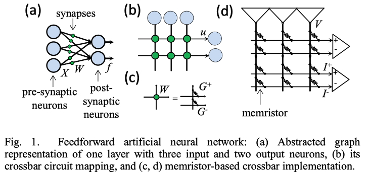

# Memristor-NN, Technion Project A.
- [Memristor-NN, Technion Project A.](#memristor-nn-technion-project-a)
  - [Background](#background)
  - [Project definition and goals](#project-definition-and-goals)
  - [Description of the algorithm](#description-of-the-algorithm)
    - [Manhattan Rule:](#manhattan-rule)
  - [Architectural design of the selected solution](#architectural-design-of-the-selected-solution)
    - [Y-Flash device](#y-flash-device)
  - [Status](#status)
    - [**Step 1**: Choosing dataset and simulating device behavior:](#step-1-choosing-dataset-and-simulating-device-behavior)
      - [Choosing Dataset:](#choosing-dataset)
    - [**Step 2**: Simulate single layered fully connected neural network and evaluating network performance](#step-2-simulate-single-layered-fully-connected-neural-network-and-evaluating-network-performance)
  - [Schedule for the remaining part](#schedule-for-the-remaining-part)
  - [Summary](#summary)
  - [Appendix:](#appendix)
    - [Appendix A: Iris Dataset](#appendix-a-iris-dataset)

## Background
Artificial neural networks (ANN) became a common solution for a wide variety of problems in many fields, such as control and pattern recognition. Many ANN solutions reached a hardware implementation phase, either commercial or with prototypes, aiming to accelerate its performance. Recent work has shown that hardware implementation, utilizing nanoscale devices, may increase the network performance dramatically, leaving far behind their digital and biological counterparts, and approaching the energy efficiency of the human brain. The background of these advantages is the fact that in analog circuits, the vector-matrix multiplication, the key operation of any neuromorphic network, is implemented on the physical level. The key component of such mixed-signal neuromorphic networks is a device with tunable conductance, essentially an analog nonvolatile memory cell, mimicking the biological synapse. There have been significant recent advances in the development of alternative nanoscale nonvolatile memory devices, such as phase change, ferroelectric, and magnetic memories. In particular, these emerging devices have already been used to demonstrate small neuromorphic networks. However, their fabrication technology is still in much need for improvement and not ready yet for the large-scale integration, which is necessary for practically valuable neuromorphic networks. This project investigates a network prototype based on mature technology of nonvolatile floating-gate memory cells.

## Project definition and goals
* Simulate single layered fully connected neural network and evaluating network performance for comparison.
* Simulate the same layer now using Manhattan Rule weights update and evaluating the rule influence on the network predictions.
* Simulating and implement the latter network now using weights being summed by positive and negative blocks as mentioned in the Manhattan Rule.
* Creating a Y-Flash neuron class to to simulate the network with small signal theory.
* Evaluating the performance under real world constraints such as: weight decrease in time or by temperature.
* Creating a Y-Flash neuron class to to simulate the network with large signal theory.
* Integration of the Y-Flash algorithm to lab equipment.
* To test what will happen if:
  * Neuron dies.

## Description of the algorithm
### Manhattan Rule:

The main contribution of this rule is the development of a crossbar circuit compatible training approach for multilayer perceptron (MLP) networks.

<h4 id="multi-layer-perceptron"><em>Multi-Layer Perceptron</em></h4>

In it's simplest form, feed-forward neural network can be represented by layers of neurons getting it's input values from a series of synapses containing weights which multiply the input from the last layer by vector multiplication. The output of the neuron can be mathematically expressed by

<math><semantics><mrow><msub><mi>f</mi><mi>i</mi></msub><mo>=</mo><mi>tanh</mi><mo>⁡</mo><mo>(</mo><mi>β</mi><msub><mi>u</mi><mi>i</mi></msub><mo>)</mo><mo separator="true">,</mo><mi>w</mi><mi>i</mi><mi>t</mi><mi>h</mi><mtext>&ThinSpace;</mtext><msub><mi>u</mi><mi>i</mi></msub><mo>=</mo><munder><mo>∑</mo><mi>j</mi></munder><msub><mi>W</mi><mrow><mi>i</mi><mi>j</mi></mrow></msub><msub><mi>X</mi><mi>j</mi></msub></mrow><annotation encoding="application/x-tex">f_{i} = \tanh(\beta u_{i}), with\, u_{i}=\sum_{j}W_{ij}X_{j} 
</annotation></semantics></math>fi​=tanh(βui​),withui​=j∑​Wij​Xj​

where <math><semantics><mrow><msub><mi>u</mi><mi>i</mi></msub></mrow><annotation encoding="application/x-tex">u_{i}</annotation></semantics></math>ui​ and <math><semantics><mrow><msub><mi>f</mi><mi>i</mi></msub></mrow><annotation encoding="application/x-tex">f_{i}</annotation></semantics></math>fi​ are the input and output of the <math><semantics><mrow><mi>i</mi></mrow><annotation encoding="application/x-tex">i</annotation></semantics></math>i-th post-synaptic neuron, respectively, <math><semantics><mrow><msub><mi>X</mi><mi>j</mi></msub></mrow><annotation encoding="application/x-tex">X_j</annotation></semantics></math>Xj​ is the output of <math><semantics><mrow><mi>j</mi></mrow><annotation encoding="application/x-tex">j</annotation></semantics></math>j-th pre-synaptic neuron, and <math><semantics><mrow><msub><mi>W</mi><mrow><mi>i</mi><mi>j</mi></mrow></msub></mrow><annotation encoding="application/x-tex">W_{ij}</annotation></semantics></math>Wij​ is the synaptic weight between <math><semantics><mrow><mi>j</mi></mrow><annotation encoding="application/x-tex">j</annotation></semantics></math>j-th presynaptic and <math><semantics><mrow><mi>i</mi></mrow><annotation encoding="application/x-tex">i</annotation></semantics></math>i-th post-synaptic neurons.

Assuming that we have a <math><semantics><mrow><mi>tanh</mi><mo>⁡</mo></mrow><annotation encoding="application/x-tex">\tanh</annotation></semantics></math>tanh activation function for the first layer. In our project the activation function we be determined

Feedforward neuron networks allow performing pattern classification task. i.e mapping input patterns into output classes. The classification is considered successful if the neuron corresponding to the target class gets the highest value. In order to achieve such neural network the weights of the synapses must be properly set. The optimal weights in the most general case cannot be calculated analytically and rater must be found by optimization procedure such as backward propagation algorithm.

Backward propagation algorithms can be implemented by batch or stochastic method. For stochastic weights are adjusted after each application of input into the network. In the first step of the algorithm a randomly chosen pattern is chosen from the dataset and applied to the network and the output is calculated.
In the 2nd step, the synaptic weight are adjusted according to

<math><semantics><mrow><mi mathvariant="normal">Δ</mi><msub><mi>W</mi><mrow><mi>i</mi><mi>j</mi></mrow></msub><mo>(</mo><mi>n</mi><mo>)</mo><mo>=</mo><mo>−</mo><mi>α</mi><msub><mi>δ</mi><mi>i</mi></msub><mo>(</mo><mi>n</mi><mo>)</mo><msub><mi>X</mi><mi>j</mi></msub><mo>(</mo><mi>n</mi><mo>)</mo></mrow><annotation encoding="application/x-tex">\Delta W_{ij}(n)=-\alpha \delta_{i}(n)X_{j}(n) 
</annotation></semantics></math>ΔWij​(n)=−αδi​(n)Xj​(n)

where <math><semantics><mrow><mi>α</mi></mrow><annotation encoding="application/x-tex">\alpha</annotation></semantics></math>α is learning rate and <math><semantics><mrow><msub><mi>δ</mi><mi>i</mi></msub></mrow><annotation encoding="application/x-tex">\delta_i</annotation></semantics></math>δi​ is the local (backpropagated) error of the corresponding post-synaptic neuron.<math><semantics><mrow><msub><mi>δ</mi><mi>i</mi></msub></mrow><annotation encoding="application/x-tex">\delta_i</annotation></semantics></math>δi​ is calculated first for output neurons, for which it is equal to the product of the derivative of neuron output with respect to its input and the difference between the actual output <math><semantics><mrow><mi>f</mi></mrow><annotation encoding="application/x-tex">f</annotation></semantics></math>f and the desired value of the output <math><semantics><mrow><mi>f</mi><mo>(</mo><mi>g</mi><mo>)</mo></mrow><annotation encoding="application/x-tex">f(g)</annotation></semantics></math>f(g) , i.e.

<math><semantics><mrow><msub><mi>δ</mi><mi>i</mi></msub><mo>=</mo><mrow><mo fence="true">[</mo><msubsup><mi>f</mi><mi>i</mi><mi>g</mi></msubsup><mo>(</mo><mi>n</mi><mo>)</mo><mo>−</mo><msub><mi>f</mi><mi>i</mi></msub><mo>(</mo><mi>n</mi><mo>)</mo><mo fence="true">]</mo></mrow><mfrac><mrow><mi>d</mi><mi>f</mi></mrow><mrow><mi>d</mi><mi>u</mi></mrow></mfrac><msub><mi mathvariant="normal">∣</mi><mrow><mi>u</mi><mo>=</mo><msub><mi>u</mi><mi>i</mi></msub><mo>(</mo><mi>n</mi><mo>)</mo></mrow></msub></mrow><annotation encoding="application/x-tex">\delta_{i}=\left[ f_{i}^{g}(n)-f_{i}(n) \right]\frac{df}{du}|_{u=u_{i}(n)} 
</annotation></semantics></math>δi​=[fig​(n)−fi​(n)]dudf​∣u=ui​(n)​

The error then propagated backward using the recurrence relation

<math><semantics><mrow><msubsup><mi>δ</mi><mi>j</mi><mrow><mi>p</mi><mi>r</mi><mi>e</mi></mrow></msubsup><mo>(</mo><mi>n</mi><mo>)</mo><mo>=</mo><mfrac><mrow><mi>d</mi><mi>f</mi></mrow><mrow><mi>d</mi><mi>u</mi></mrow></mfrac><msub><mi mathvariant="normal">∣</mi><mrow><mi>u</mi><mo>=</mo><msub><mi>u</mi><mi>i</mi></msub><mo>(</mo><mi>n</mi><msup><mo>)</mo><mrow><mi>p</mi><mi>r</mi><mi>e</mi></mrow></msup></mrow></msub><munder><mo>∑</mo><mi>i</mi></munder><msubsup><mi>δ</mi><mi>i</mi><mrow><mi>p</mi><mi>o</mi><mi>s</mi><mi>t</mi></mrow></msubsup><mo>(</mo><mi>n</mi><mo>)</mo><msub><mi>W</mi><mrow><mi>i</mi><mi>j</mi></mrow></msub><mo>(</mo><mi>n</mi><mo>)</mo></mrow><annotation encoding="application/x-tex">\delta_{j}^{pre}(n) = \frac{df}{du}|_{u=u_{i}(n)^{pre}}\sum_{i}\delta_{i}^{post}(n)W_{ij}(n) 
</annotation></semantics></math>δjpre​(n)=dudf​∣u=ui​(n)pre​i∑​δipost​(n)Wij​(n)

The application of all patterns from a training set constitutes one epoch of training with multiple epochs typically required for successful training. In the simplest version of the batch backpropagation algorithm, the synaptic weights are adjusted by

<math><semantics><mrow><mi mathvariant="normal">Δ</mi><msubsup><mi>W</mi><mrow><mi>i</mi><mi>j</mi></mrow><mo mathvariant="normal">′</mo></msubsup><mo>=</mo><munder><mo>∑</mo><mi>n</mi></munder><mi mathvariant="normal">Δ</mi><msub><mi>W</mi><mrow><mi>i</mi><mi>j</mi></mrow></msub><mo>(</mo><mi>n</mi><mo>)</mo></mrow><annotation encoding="application/x-tex">\Delta W_{ij}&#x27;=\sum_{n}\Delta W_{ij}(n) 
</annotation></semantics></math>ΔWij′​=n∑​ΔWij​(n)

only at the end of each epoch.

<h4 id="mlp-implementation-with-crossbar-circuits"><em>MLP Implementation with Crossbar Circuits</em></h4>

The MLP structure maps naturally to the crossbar array circuit (Fig. 1b). In particular, <math><semantics><mrow><mi>X</mi></mrow><annotation encoding="application/x-tex">X</annotation></semantics></math>X and <math><semantics><mrow><mi>f</mi></mrow><annotation encoding="application/x-tex">f</annotation></semantics></math>f are physically implemented with voltages <math><semantics><mrow><mi mathvariant="normal">∣</mi><mi>V</mi><mi mathvariant="normal">∣</mi><mo>≤</mo><mi>V</mi></mrow><annotation encoding="application/x-tex">|V | \leq  V</annotation></semantics></math>∣V∣≤V read , while neuron’s input <math><semantics><mrow><mi>u</mi></mrow><annotation encoding="application/x-tex">u</annotation></semantics></math>u with current <math><semantics><mrow><mi>I</mi></mrow><annotation encoding="application/x-tex">I</annotation></semantics></math>I. Synapses are implemented with crosspoint devices whose conductance <math><semantics><mrow><mi>G</mi></mrow><annotation encoding="application/x-tex">G</annotation></semantics></math>G is proportional to the synaptic weight <math><semantics><mrow><mi>W</mi></mrow><annotation encoding="application/x-tex">W</annotation></semantics></math>W. Because weight values can be negative, while physical conductance is strictly positive, one solution is to represent each synaptic weight with a pair of crosspoint devices , which are denoted as <math><semantics><mrow><msup><mi>G</mi><mo>+</mo></msup></mrow><annotation encoding="application/x-tex">G^{+}</annotation></semantics></math>G+ and <math><semantics><mrow><msup><mi>G</mi><mo>−</mo></msup></mrow><annotation encoding="application/x-tex">G^{-}</annotation></semantics></math>G− , i.e.

<math><semantics><mrow><msub><mi>W</mi><mrow><mi>i</mi><mi>j</mi></mrow></msub><mo>=</mo><msubsup><mi>G</mi><mrow><mi>i</mi><mi>j</mi></mrow><mo>+</mo></msubsup><mo>−</mo><msubsup><mi>G</mi><mrow><mi>i</mi><mi>j</mi></mrow><mo>−</mo></msubsup></mrow><annotation encoding="application/x-tex">W_{ij} = G_{ij}^{+}-G_{ij}^{-} 
</annotation></semantics></math>Wij​=Gij+​−Gij−​

In such configuration, neuron receives two currents – one from the crossbar line with weights <math><semantics><mrow><msup><mi>G</mi><mo>+</mo></msup></mrow><annotation encoding="application/x-tex">G^{+}</annotation></semantics></math>G+ and another from the line with weights <math><semantics><mrow><msup><mi>G</mi><mo>−</mo></msup></mrow><annotation encoding="application/x-tex">G^{-}</annotation></semantics></math>G− , so that the negative weights are implemented due to the subtraction of these two currents inside the neuron. With <math><semantics><mrow><msub><mi>G</mi><mrow><mi>m</mi><mi>a</mi><mi>x</mi></mrow></msub></mrow><annotation encoding="application/x-tex">G_{max}</annotation></semantics></math>Gmax​ and <math><semantics><mrow><msub><mi>G</mi><mrow><mi>m</mi><mi>i</mi><mi>n</mi></mrow></msub></mrow><annotation encoding="application/x-tex">G_{min}</annotation></semantics></math>Gmin​ being the maximum and the minimum conductances of the crosspoint devices, respectively, the effective weight ranges from <math><semantics><mrow><mo>−</mo><msub><mi>G</mi><mrow><mi>m</mi><mi>a</mi><mi>x</mi></mrow></msub><mo>+</mo><msub><mi>G</mi><mrow><mi>m</mi><mi>i</mi><mi>n</mi></mrow></msub></mrow><annotation encoding="application/x-tex">-G_{max} + G_{min}</annotation></semantics></math>−Gmax​+Gmin​ to <math><semantics><mrow><msub><mi>G</mi><mrow><mi>m</mi><mi>a</mi><mi>x</mi></mrow></msub><mo>−</mo><msub><mi>G</mi><mrow><mi>m</mi><mi>i</mi><mi>n</mi></mrow></msub></mrow><annotation encoding="application/x-tex">G_{max} - G_{min}</annotation></semantics></math>Gmax​−Gmin​ .

Assuming virtually-grounded inputs of the post-synaptic neuron, input current I is equal to the product <math><semantics><mrow><mi>G</mi><mi>V</mi></mrow><annotation encoding="application/x-tex">GV</annotation></semantics></math>GV. The current difference is then converted to voltage via an operational amplifier with feedback resistor <math><semantics><mrow><mi>R</mi></mrow><annotation encoding="application/x-tex">R</annotation></semantics></math>R and then applied to a saturating operational amplifier to approximate the hyperbolic tangent activation function, i.e. implementing feed forward on the physical level:

<math><semantics><mrow><msubsup><mi>V</mi><mi>i</mi><mrow><mi>p</mi><mi>o</mi><mi>s</mi><mi>t</mi></mrow></msubsup><mo>=</mo><msub><mi>V</mi><mrow><mi>r</mi><mi>e</mi><mi>a</mi><mi>d</mi></mrow></msub><mi>tanh</mi><mo>⁡</mo><mo>[</mo><mi>R</mi><mo>(</mo><msubsup><mi>I</mi><mi>i</mi><mo>+</mo></msubsup><mo>−</mo><msubsup><mi>I</mi><mi>i</mi><mo>−</mo></msubsup><mo>)</mo><mo>]</mo><mo separator="true">,</mo></mrow><annotation encoding="application/x-tex">V_{i}^{post}=V_{read}\tanh[R(I_{i}^{+}-I_{i}^{-})], 
</annotation></semantics></math>Vipost​=Vread​tanh[R(Ii+​−Ii−​)],

<math><semantics><mrow><msub><mi>I</mi><mi>i</mi></msub><mo>=</mo><msubsup><mi>I</mi><mi>i</mi><mo>+</mo></msubsup><mo>−</mo><msubsup><mi>I</mi><mi>i</mi><mo>−</mo></msubsup><mo>=</mo><munder><mo>∑</mo><mi>j</mi></munder><mo>(</mo><msubsup><mi>G</mi><mrow><mi>i</mi><mi>j</mi></mrow><mo>+</mo></msubsup><mo>−</mo><msubsup><mi>G</mi><mrow><mi>i</mi><mi>j</mi></mrow><mo>−</mo></msubsup><mo>)</mo><msubsup><mi>V</mi><mi>j</mi><mrow><mi>p</mi><mi>r</mi><mi>e</mi></mrow></msubsup></mrow><annotation encoding="application/x-tex">I_{i}=I_{i}^{+}-I_{i}^{-}=\sum_{j}(G_{ij}^{+}-G_{ij}^{-})V_{j}^{pre} 
</annotation></semantics></math>Ii​=Ii+​−Ii−​=j∑​(Gij+​−Gij−​)Vjpre​

For the in-situ training to be practical, its area and time overhead should be minimized. Fortunately, there are some useful variations of the backpropagation algorithm, which allow much more efficient implementation of training in the considered memristive crossbar networks. Here, we consider one such example Manhattan Rule training - which is a coarse-grain variation of backpropagation algorithm. In Manhattan Rule only sign information of weight adjustment is utilized so that weight updates become:

<math><semantics><mrow><mi mathvariant="normal">Δ</mi><msubsup><mi>W</mi><mrow><mi>i</mi><mi>j</mi></mrow><mi>M</mi></msubsup><mo>(</mo><mi>n</mi><mo>)</mo><mo>=</mo><mi>s</mi><mi>g</mi><mi>n</mi><mo>[</mo><mi mathvariant="normal">Δ</mi><msub><mi>W</mi><mrow><mi>i</mi><mi>j</mi></mrow></msub><mo>(</mo><mi>n</mi><mo>)</mo><mo>]</mo></mrow><annotation encoding="application/x-tex">\Delta W_{ij}^{M}(n) = sgn[\Delta W_{ij}(n)] 
</annotation></semantics></math>ΔWijM​(n)=sgn[ΔWij​(n)]

The main appeal of such a training algorithm is that all weights are updated by the same amount, which simplifies the weight update operation and creates an opportunity for efficient implementation of in-situ training in hardware.

[E. Zamanidoost, F. M. Bayat, D. Strukov and I. Kataeva, &quot;Manhattan rule training for memristive crossbar circuit pattern classifiers,&quot; 2015 IEEE 9th International Symposium on Intelligent Signal Processing (WISP) Proceedings, Siena, 2015, pp. 1-6.]

## Architectural design of the selected solution
### Y-Flash device
* Physical behavior:
* Program and erase:

## Status
- [x] Choosing appropriate dataset for project - **Iris dataset**
- [x] Simulating device in Virtouso
- [ ] Simulate single layered fully connected neural network and evaluating network performance for comparison.
  - [ ] Code simple 1-layer neural network
  - [ ] Train and evaluate network performance
  - [ ] Compare to state of the art networks.

---
### **Step 1**: Choosing dataset and simulating device behavior:
#### Choosing Dataset:
 By hardware constraints we were bound to use a 8*12 Y-Flash device array. By this constraint and because we plan to implement the neuron weights with 2 Y-Flash devices one from positive and one for negative weight, we chose to work on the Iris data. Being a 4 input data set with 3 output predictions. A fitting choice since we have a 8 row array which computes into a 4 neuron layer since weights represented using 2 Devices.
 #### Simulating device: 

### **Step 2**: Simulate single layered fully connected neural network and evaluating network performance

 1. We chose to work with pytorch as our neural network platform because of the robustness and the available modification we can implement in order to simulate the Y-Flash device behavior.
 2. 

## Schedule for the remaining part

## Summary

## Appendix:
### Appendix A: Iris Dataset
From Wikipedia:

The **Iris flower** data set or Fisher's Iris data set is a multivariate data set introduced by the British statistician and biologist Ronald Fisher in his 1936 paper The use of multiple measurements in taxonomic problems as an example of linear discriminant analysis. It is sometimes called Anderson's Iris data set because Edgar Anderson collected the data to quantify the morphologic variation of Iris flowers of three related species. Two of the three species were collected in the Gaspé Peninsula "all from the same pasture, and picked on the same day and measured at the same time by the same person with the same apparatus".

The data set consists of 50 samples from each of t**hree species** of Iris (Iris setosa, Iris virginica and Iris versicolor). **Four features** were measured from each sample: the length and the width of the sepals and petals, in centimeters. Based on the combination of these four features, Fisher developed a linear discriminant model to distinguish the species from each other

**Sample data:**

| Feature 1 | Feature 2 | Feature 3 | Feature 4 |
| --------- | --------- | --------- | --------- |
| 5.1       | 3.5       | 1.4       | 0.2       |
| 4.9       | 3.0       | 1.4       | 0.2       |
| 4.7       | 3.2       | 1.3       | 0.2       |
| 4.6       | 3.1       | 1.5       | 0.2       |
| 5.0       | 3.6       | 1.4       | 0.2       |
